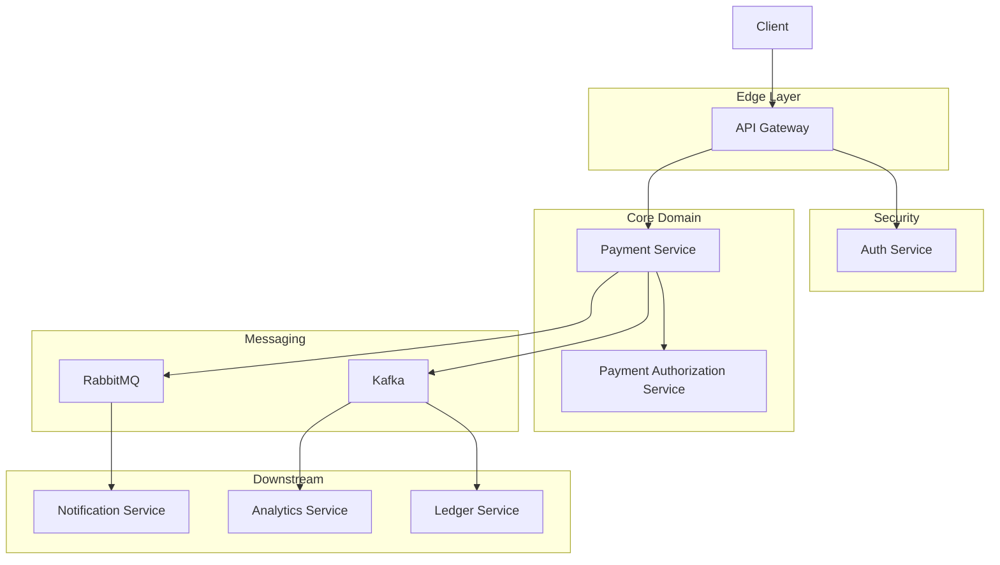

# PayFlowX – Distributed Payment Orchestration Platform

PayFlowX is a backend-focused, production-style **payment orchestration system** designed to model real-world payment lifecycles in distributed financial systems. The platform supports **login, payment initiation, authorization, and asynchronous downstream processing** using an event-driven architecture.

The system demonstrates **centralized authentication enforcement, payment state management, idempotency, transactional consistency, event streaming with Kafka, and asynchronous execution with RabbitMQ**, implemented using Spring Boot and PostgreSQL.

---

## Microservices Overview

PayFlowX consists of **seven independently deployable microservices**, each owning its data and responsibilities.

| Service                   | Responsibility                                       |
| ------------------------- | ---------------------------------------------------- |
| **API Gateway**           | Central entry point, JWT validation, request routing |
| **Auth Service**          | Login-only authentication and JWT issuance           |
| **Payment Service**       | Orchestrates payment lifecycle and publishes events  |
| **Authorization Service** | Validates balance, limits, and payment rules         |
| **Ledger Service**        | Maintains immutable financial ledger                 |
| **Notification Service**  | Sends payment notifications asynchronously           |
| **Analytics Service**     | Builds read-optimized aggregates from events         |
| **Eureka Server**         | Service discovery and registration                   |

---

## High-Level Architecture

