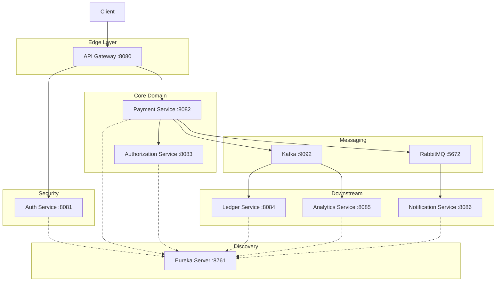
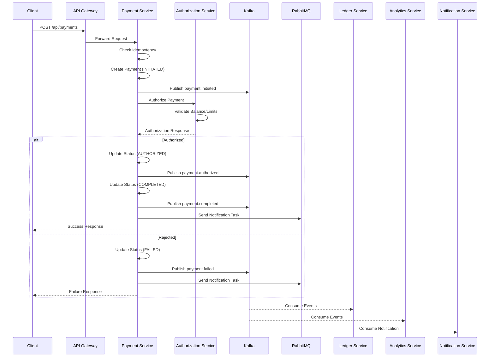

# PayFlowX – Distributed Payment Orchestration Platform

PayFlowX is a backend-focused, production-style **payment orchestration system** designed to model real-world payment lifecycles in distributed financial systems. The platform supports **login, payment initiation, authorization, and asynchronous downstream processing** using an event-driven architecture.

The system demonstrates **centralized authentication enforcement, payment state management, idempotency, transactional consistency, event streaming with Kafka, and asynchronous execution with RabbitMQ**, implemented using Spring Boot and PostgreSQL.

---

## Microservices Overview

PayFlowX consists of **seven independently deployable microservices**, each owning its data and responsibilities.

| Service                   | Port   | Responsibility                                       |
| ------------------------- | ------ | ---------------------------------------------------- |
| **Eureka Server**         | 8761   | Service discovery and registration                   |
| **API Gateway**           | 8080   | Central entry point, JWT validation, request routing |
| **Auth Service**          | 8081   | Login-only authentication and JWT issuance           |
| **Payment Service**       | 8082   | Orchestrates payment lifecycle and publishes events  |
| **Authorization Service** | 8083   | Validates balance, limits, and payment rules         |
| **Ledger Service**        | 8084   | Maintains immutable financial ledger                 |
| **Analytics Service**     | 8085   | Builds read-optimized aggregates from events         |
| **Notification Service**  | 8086   | Sends payment notifications asynchronously           |

---

## High-Level Architecture



---

## Payment Flow



---

## Tech Stack

| Layer              | Technology                          |
| ------------------ | ----------------------------------- |
| **Runtime**        | Java 17, Spring Boot 3.5            |
| **Service Discovery** | Netflix Eureka                   |
| **API Gateway**    | Spring Cloud Gateway                |
| **Database**       | PostgreSQL (one DB per service)     |
| **Event Streaming**| Apache Kafka                        |
| **Message Queue**  | RabbitMQ                            |
| **Inter-Service**  | OpenFeign                           |
| **Containerization** | Docker, Docker Compose            |

---

## Database Architecture

Each microservice owns its database following the **Database per Service** pattern:

| Service               | Database                  |
| --------------------- | ------------------------- |
| Auth Service          | `payflowx_users`          |
| Authorization Service | `payflowx_authorization`  |
| Payment Service       | `payflowx_payment`        |
| Ledger Service        | `payflowx_ledger`         |
| Analytics Service     | `payflowx_analytics`      |
| Notification Service  | `payflowx_notification`   |

---

## Key Features

### Idempotency
Prevents duplicate payments using client-provided `idempotencyKey`. If the same key is sent twice, the original payment response is returned.

### Payment State Machine
```
INITIATED → AUTHORIZED → COMPLETED
     ↓           ↓
   FAILED      FAILED
```

### Event-Driven Architecture
- **Kafka Topics**: `payment-events` for durable event streaming
- **RabbitMQ Queue**: `payment-notifications` for async notifications

### Event Types
| Event               | Published When              | Consumers                    |
| ------------------- | --------------------------- | ---------------------------- |
| `payment.initiated` | Payment record created      | Ledger, Analytics            |
| `payment.authorized`| Authorization approved      | Analytics                    |
| `payment.completed` | Payment fully processed     | Ledger, Analytics            |
| `payment.failed`    | Authorization rejected      | Ledger, Analytics            |

---

## Project Structure

```
payflowx/
├── docker-compose.yml
├── eureka-server/
├── api-gateway/
├── auth-service/
├── authorization-service/
├── payment-service/
├── ledger-service/
├── analytics-service/
└── notification-service/
```

---

